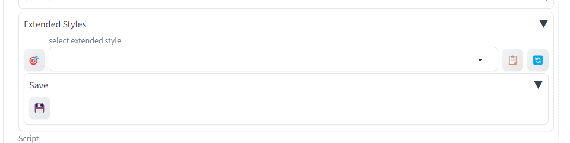
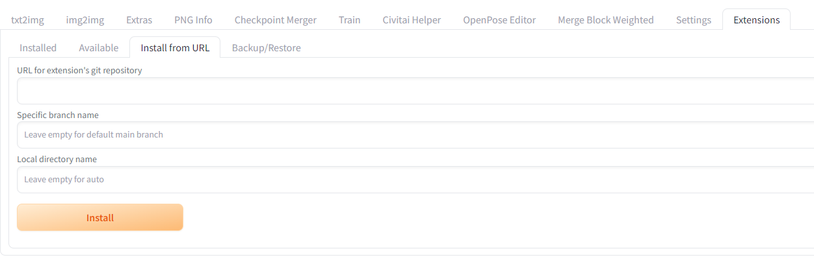
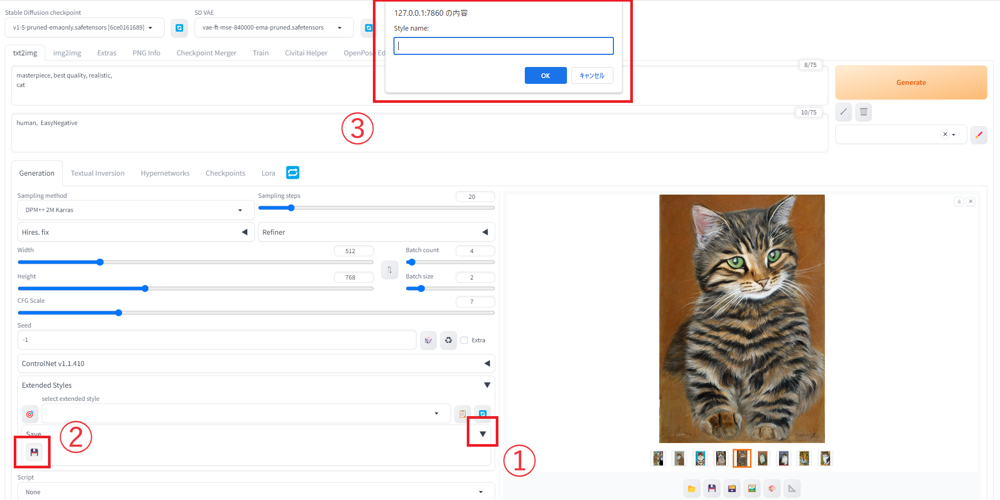
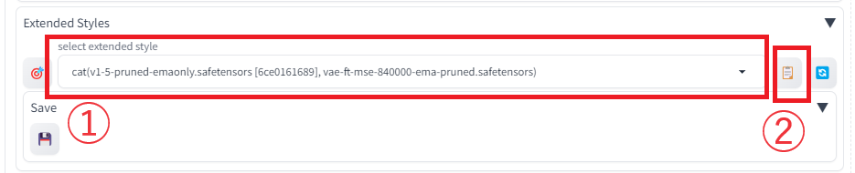
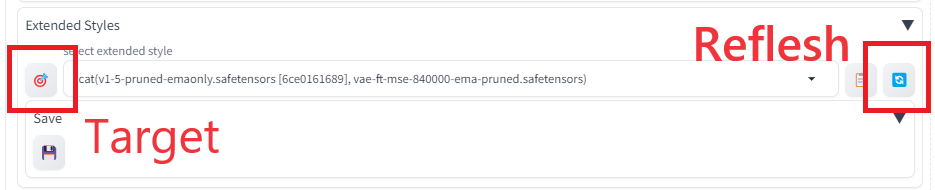

# Extended Style Saver

## はじめに

### 機能説明

プロンプトやネガティブプロンプト、画像サイズや使用モデル、VAEの保存が可能です。

### インストール方法

Install from URLから、本プロジェクトのURLを入力してInstallしてください。

## 使い方

### プロンプト保存方法

1. アコーディオンを開く
2. saveアイコンをクリック
3. スタイル名を入力し、OKをクリック

### 適用方法

1. 適用したいスタイルを選択
2. ノートアイコンをクリック

### その他

#### Target

現在選択しているモデル・VAEを使用したスタイルのみに選択肢をフィルタリングします。
全リストを再表示したい場合は下記Refleshボタンを使用してください。

#### Reflesh

選択肢を最新状態にします。
F5リロードを行った場合など、選択肢が古くなってしまった場合に使用してください。

## FAQ

### zz-のプレフィックスは何？

他の拡張機能への対応を考慮したとき、
本拡張機能が一番最後に読み込まれる必要がありました。

例えば、ControlNetに対応するためには
"sd-webui-controlnet"
より後に読み込まれる必要があります。

"extended-style-saver"
というプロジェクト名では対応できませんでしたため、
先頭に"zz"を付けています。
"sd-webui"の文字は他の拡張機能に倣って付けています。
