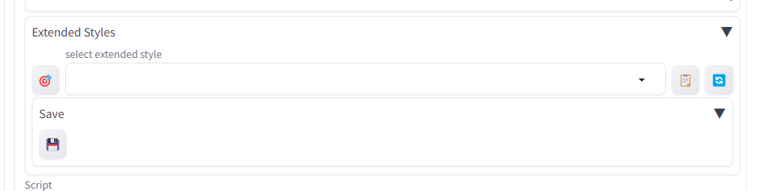
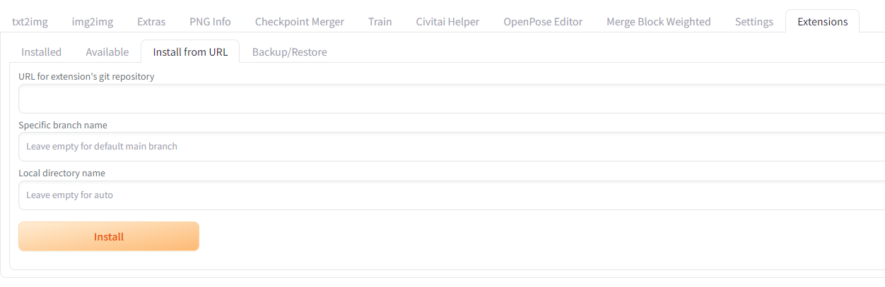
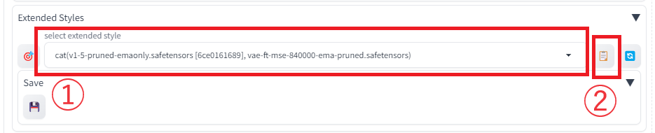
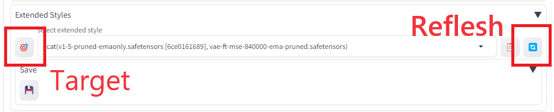

# Extended Style Saver

## Introduction

### Feature Description

You can save prompts, negative prompts, image sizes, used models, and VAEs.

### Installation Method

Please enter this project's URL in "Install from URL" and click Install.

## How to Use

### How to Save Prompts

1. Open the accordion
2. Click the save icon
3. Enter the style name and click OK

### How to Restore Prompts

1. Select the style you want to restore
2. Click the note icon

### Other Features

#### Target

Filters options to only the styles using the currently selected model and VAE. If you want to redisplay the entire list, use the Refresh button below.

#### Refresh

Updates the options to the latest state. Use this if options have become outdated, for example, after performing an F5 reload.

## FAQ

### What does the zz- prefix mean?

Considering the compatibility with other extensions,
it was necessary for this extension to be loaded last.

For instance, to accommodate ControlNet,
it needs to be loaded after "sd-webui-controlnet".

The project name "extended-style-saver" couldn't accommodate this,
hence the prefix "zz" is attached at the beginning.
"sd-webui" is appended following the convention of other extensions.
