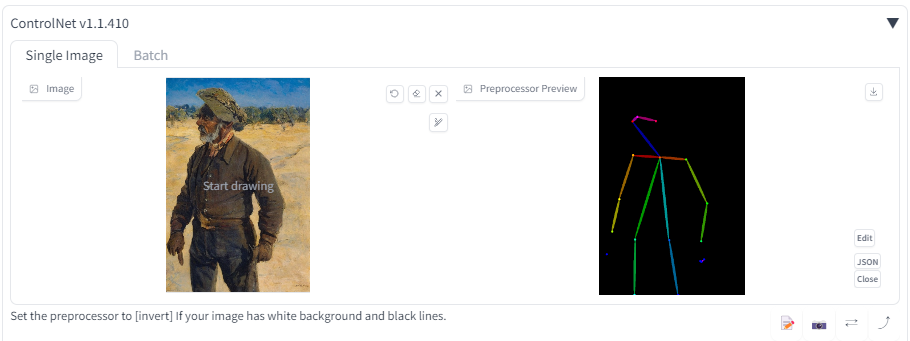

# Usage With ControlNet

## Instructions

### Save

Please pre-create a Preprocessor Preview.
When executing Save, it will save the image from the Preprocessor Preview along.
If there's no Preprocessor Preview, it will save the image found in the 'image' instead.

### Apply

If there is ControlNet data in chosen style,
it will automatically insert an image into the image field and check the 'enable'.

Regardless of whether you are using ControlNet or not,
the ControlNet accordion will open.
This is due to the constraints on the execution timing of the Stable Diffusion program.
